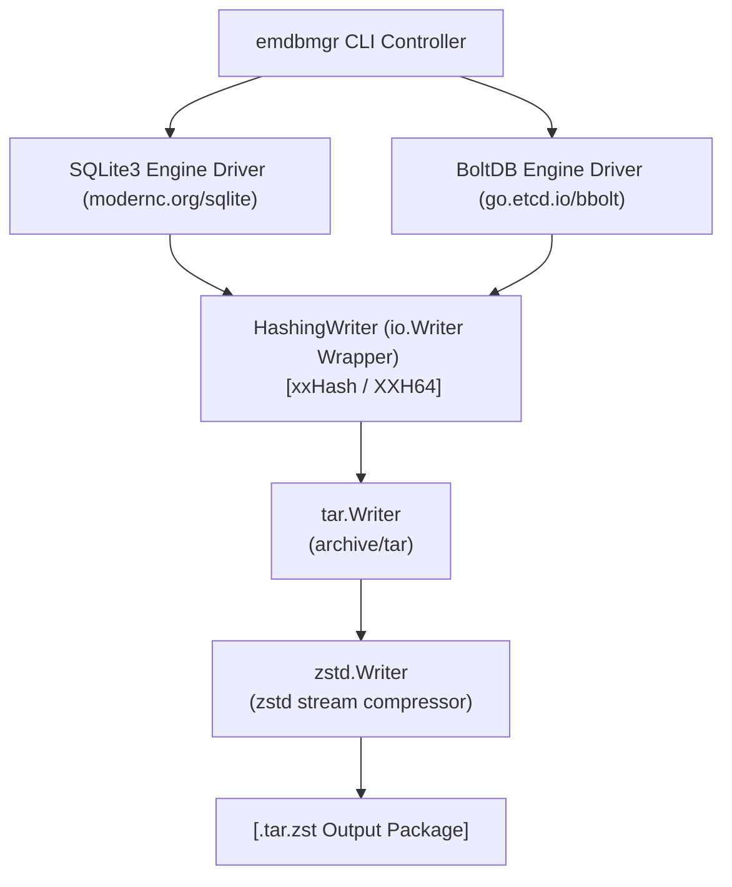
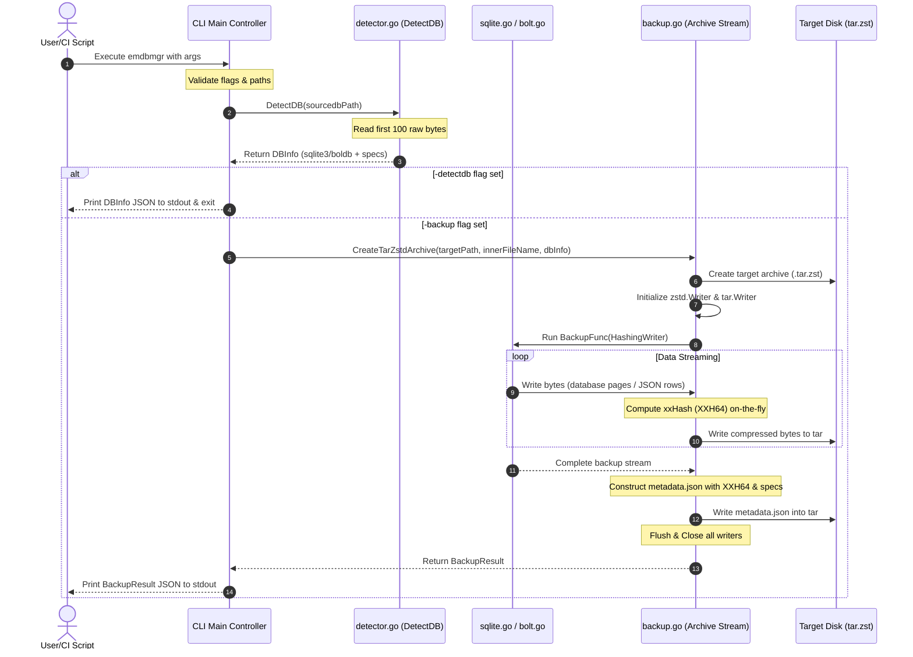

# Embedded Database Manager (`emdbmgr`) - Technical Specification & User Manual

`emdbmgr` is a cross-platform, high-performance command-line utility written in Go. It is designed to inspect, identify, and perform safe, non-blocking, transactionally consistent backups of SQLite3 and BoltDB databases.

---

## 1. Application Overview and Objectives

The primary objective of `emdbmgr` is to manage embedded database files (SQLite3 and BoltDB) in active production systems without causing locks, writes blockade, or data corruption. 

### Core Operational Objectives:
* **Format Agnosticism via Hex Signature Detection:** Identify the database engine format directly from the file header rather than trusting filename extensions.
* **ACID-Compliant Backups on Open Databases:** Replicate active, open databases without interrupting writers or reading partially written or corrupted transactions.
* **Low System Resource Footprint:** Maintain a $O(1)$ memory consumption profile by streaming backups and compression pipelines, eliminating large intermediate uncompressed RAM buffers.
* **Agnostic and Portable Tooling:** Compile cleanly across multiple target OS/architectures (Windows, Linux, macOS) by enforcing a CGO-free driver design.
* **Self-Verifying Deliverables:** Package the backup and its dynamic operational telemetry (execution duration, platform, sizes, specs, and xxHash integrity checksum) into a single, compact archive.

---

## 2. Architecture and Design Choices

The architecture of `emdbmgr` is built on several key technical decisions:



### 2.1 CGO-Free SQLite Driver (`modernc.org/sqlite`)
To ensure complete portability and eliminate external C-runtime dependencies during compilation (which typically require `gcc` on Windows or specialized toolchains on Linux), the application leverages `modernc.org/sqlite`. This is a pure-Go translation of the SQLite C engine. It implements the standard Go `database/sql` interface and matches the performance and stability profile of C-based drivers without CGO compiler overhead.

### 2.2 Concurrency, Security, & Transaction Safety Models
Database file copies executed at the operating system level while a database is actively being written to can lead to "hot journals" or corrupted WAL (Write-Ahead Log) states. `emdbmgr` addresses this through database-specific concurrency and security safety models:
* **SQLite3 Safe Copy (`-backup=db`):** Invokes the SQLite `VACUUM INTO` command over a read-only (`mode=ro`) connection. The SQLite engine locks the database in a shared read state, processes page fragmentation, and copies pages directly to a temporary replica file. Active write transactions are not blocked, and the output is transactionally consistent.
* **SQLite3 Data Extraction & Sanitization (`-backup=json`):** Queries table structures dynamically and loops through rows sequentially. Table names are dynamically sanitized using strict character validation (`strings.ContainsAny`) to eliminate any risk of SQL injection prior to query formatting, and scanned interfaces are streamed directly as JSON.
* **BoltDB Shared Read Access & Lock Timeout (`-backup=db` and `-backup=json`):** BoltDB operates a single-writer, multi-reader MVCC (Multi-Version Concurrency Control) model. `emdbmgr` opens BoltDB files in shared read-only mode (`ReadOnly: true`). To prevent indefinite production hangs due to exclusive writer locks, it enforces a strict **`5 * time.Second` lock acquisition timeout**. On success, it launches a read-only transaction (`db.View`):
  * For raw block-level replication (`db`), it executes Bolt's internal `tx.Copy(w)` block copy.
  * For JSON extraction (`json`), it traverses the B+ tree recursively via cursors, streaming key-values directly.
* **Pre-Flight Input Sanitization**: Before passing any file paths to database engines, the CLI explicitly validates that the file exists, is a regular file (not a directory), is readable, and cleans the path using `filepath.Clean`.

#### Summary of Concurrency Safety:

| Operation | DB Format | Concurrency Mechanism | Blocking Behavior on Writers | Data Corruption Risk |
|---|---|---|---|---|
| `-detectdb` | Both | OS-level `os.Open` (with Read-Share) | Zero Blocking | Zero |
| `-backup=db` | SQLite3 | Read-only connection + SQL `VACUUM INTO` | Zero Blocking (in WAL mode) | Zero (ACID consistent) |
| `-backup=db` | BoltDB | Shared Read-only open + `db.View` + `tx.Copy` | Zero Blocking (MVCC isolated) | Zero (ACID consistent) |
| `-backup=json` | SQLite3 | Read-only connection + streaming `SELECT` row scan | Zero Blocking (in WAL mode) | Zero (ACID consistent) |
| `-backup=json` | BoltDB | Shared Read-only open + `db.View` + cursor tree scan | Zero Blocking (MVCC isolated) | Zero (ACID consistent) |


### 2.3 Compressed Tar Stream Packaging with On-the-Fly xxHash & Hybrid Staging
The backup engine combines tape archiving (`archive/tar`) and Zstandard compression (`github.com/klauspost/compress/zstd`) in a single streaming pipeline:
* **The HashingWriter Wrapper:** A custom structural writer wraps the file stream, intercepting written bytes to compute a 64-bit **xxHash (XXH64)** on-the-fly (`github.com/cespare/xxhash/v2`) at near-RAM speeds.
* **Redundancy Elimination:** Rather than storing loose, vulnerable `.xxh64` files on disk, the checksum and execution telemetry (file sizes, host platform, durations, specific DB details) are formatted as a JSON document (`metadata.json`) and appended directly inside the `.tar.zst` archive package alongside the backup data.
* **Dynamic Spill-to-Disk Hybrid Buffer (`HybridWriter`):** Staging uncompressed size formats in memory up to **32 MB** in a `bytes.Buffer` for zero-I/O rapid execution. Backups exceeding 32 MB automatically spill to a secure local temp file on disk, maintaining low RAM profiles.
* **Partition-Safe Atomic Rename Commit**: To ensure backup integrity, files are written as `.tar.zst.tmp` in the **exact same target directory** (guaranteeing same-partition O(1) atomic filesystem swaps) and renamed to `.tar.zst` only upon full stream flush and close.
* **High-Speed Buffered Writes & Parallelism**: Output streams are buffered using a `128 KB` `bufio.WriterSize` to minimize system write syscalls, and the Zstandard encoder is parallelized across all cores using Go's `runtime.NumCPU()`.

### 2.4 Portable Multi-Platform Testing Strategy
To maintain a strict zero-footprint repository policy during integration and CI/CD tests, `emdbmgr` enforces an isolated testing environment strategy:
* **Compile-on-the-Fly Isolation:** The test suite compiles the source code on-the-fly directly into the resolved temp folder, preventing untracked executables or database files from cluttering the version-controlled repository workspace.
* **Environment-Variable Priority Resolution:** The test runner resolves the baseline temporary directory by evaluating environment variables in a strict sequential cascade:
  1. **`TMPDIR`**
  2. **`TEMP`**
  3. **`TMP`**
  4. **System Fallbacks:** `c:\temp` on Windows systems; `/tmp` on Linux and Unix environments.
* **Dynamic Sandboxed Execution:** All target test databases, timestamped output archives, and extracted verification steps are containerized within a dynamically generated sandboxed subfolder (`unitests/emdbmgr_test_*`) inside the resolved temporary base path, which is cleaned up automatically upon execution exit.

---

## 3. Data Flow and Control Logic

### 3.1 Operational Control Flow
1. **CLI Execution:** Command line flags are validated. If `-version` is set, version info is immediately printed to stdout and the process terminates.
2. **Dynamic Format Detection (`DetectDB`):** The program opens the database in read-only mode and reads the first 100 bytes of the file.
   * If bytes 0–15 match `"SQLite format 3\0"`, the engine is classified as `sqlite3` and SQLite metrics (page size, WAL state, user version, schema version) are extracted.
   * If the first 16 bytes match Bolt's metadata page header flags (`metaPageFlag = 0x04`) and bytes 16–19 match Bolt's system-endian magic number `0xED0CDAED`, the engine is classified as `boldb` and Bolt metrics (version, page size, transaction ID, page count) are extracted.
3. **Backup Routing:** If `-backup` is requested, the program routes the detected DB structure into the appropriate driver methods based on the requested output formats (`json`, `db`, or both).
4. **Archive Stream Pipeline:**
   * Opens the target file on disk (`.tar.zst`).
   * Wraps it in a `zstd.Writer` and nests a `tar.Writer` inside it.
   * Runs the dynamic backup stream, intercepting written bytes with `HashingWriter` to compute the xxHash.
   * Generates a structural metadata document (`metadata.json`) containing the dynamic hash and system metrics, and appends it to the archive.
   * Flushes and closes all streams.
5. **Stdout CLI Report:** Emits a formal JSON result block to stdout detailing the backup operation.

### 3.2 System Sequence Diagram


---

## 4. Dependencies

`emdbmgr` uses minimal external dependencies to ensure reliability and maintain CGO-free compilation:

| Dependency Package | Purpose | CGO Requirement |
|---|---|---|
| `std/archive/tar` | Packaging multiple files (data file + metadata JSON). | None (Go standard library) |
| `std/database/sql` | Abstract SQL connection management. | None (Go standard library) |
| `modernc.org/sqlite` | CGO-free pure-Go SQLite3 database engine driver. | **None** |
| `go.etcd.io/bbolt` | Standard active BoltDB embedded engine. | **None** |
| `github.com/klauspost/compress/zstd` | High-performance, streaming Zstandard compression. | **None** |
| `github.com/cespare/xxhash/v2` | Highly optimized assembly/Go xxHash (XXH64) digest engine. | **None** |

---

## 5. Command Line Arguments

`emdbmgr` offers a clear CLI argument structure to configure runtime behavior:

| Argument | Type | Default Value | Description |
|---|---|---|---|
| `-version` | Boolean | `false` | Prints the application name and the compile-time injected version, then exits cleanly. |
| `-detectdb` | Boolean | `false` | Inspects the raw signature of `-sourcedb-path` and dumps the parsed metadata to stdout in JSON. |
| `-backup` | String | `""` | Specifies the backup execution mode. Accepted values: `db`, `json`, or `json,db` (comma-separated for simultaneous dual backup). |
| `-sourcedb-path` | String | `""` | Absolute or relative filesystem path to the active source SQLite or BoltDB file. |
| `-targetdata-path`| String | `""` | Destination path. For dual-backups or directories, this acts as the target backup folder. |

---

## 6. Detailed Examples on How to Use

### 6.1 Compiling the Binary
To compile a lightweight, optimized CGO-free binary:
```bash
go build -o emdbmgr.exe
```

To inject a custom production version string at compile-time (e.g. into your CD build pipeline):
```bash
go build -ldflags "-X main.version=1.4.2-stable" -o emdbmgr.exe
```

---

### 6.2 Checking Tool Version
```bash
emdbmgr -version
```
**Stdout Output:**
```text
Embedded Database Manager - v1.4.2-stable
```

---

### 6.3 Detecting SQLite3 Database Specs
```bash
emdbmgr -detectdb -sourcedb-path=/data/sftpgo.db
```
**Stdout Output:**
```json
{
  "file_path": "/data/sftpgo.db",
  "file_size_bytes": 102400,
  "db_type": "sqlite3",
  "sqlite_details": {
    "magic_matched": true,
    "page_size": 4096,
    "write_version": 2,
    "read_version": 2,
    "wal_mode": true,
    "schema_version": 4,
    "user_version": 0
  }
}
```

---

### 6.4 Detecting BoltDB Database Specs
```bash
emdbmgr -detectdb -sourcedb-path=/data/bolt_cache.db
```
**Stdout Output:**
```json
{
  "file_path": "/data/bolt_cache.db",
  "file_size_bytes": 65536,
  "db_type": "boldb",
  "bolt_details": {
    "magic_matched": true,
    "version": 2,
    "page_size": 4096,
    "tx_id": 142,
    "page_count": 16
  }
}
```

---

### 6.5 Safe Backup: Database Replication (Shadow DB)
To create a safe shadow copy of an active database:
```bash
emdbmgr -backup=db -sourcedb-path=/data/sftpgo.db -targetdata-path=/backups
```
**Stdout Output:**
```json
{
  "backup_type": "db",
  "target_path": "/backups/backup_sftpgo_sqlite-20260528135822.db.tar.zst",
  "data_xxh64": "2b97537832b3d9b8",
  "duration_ms": 12,
  "status": "success"
}
```

---

### 6.6 Safe Backup: Dynamic JSON Extraction
To dump an active database as raw JSON:
```bash
emdbmgr -backup=json -sourcedb-path=/data/bolt_cache.db -targetdata-path=/backups
```
**Stdout Output:**
```json
{
  "backup_type": "json",
  "target_path": "/backups/backup_bolt_cache_bolt-20260528135822.json.tar.zst",
  "data_xxh64": "83b5f78fbb3fb191",
  "duration_ms": 4,
  "status": "success"
}
```

---

### 6.7 Safe Backup: Dual Mode (Shadow DB + JSON Extraction)
To execute both backup methods simultaneously:
```bash
emdbmgr -backup=json,db -sourcedb-path=/data/sftpgo.db -targetdata-path=/backups
```
**Stdout Output:**
```json
[
  {
    "backup_type": "json",
    "target_path": "/backups/backup_sftpgo_sqlite-20260528135822.json.tar.zst",
    "data_xxh64": "be6b2b95315ad19f",
    "duration_ms": 5,
    "status": "success"
  },
  {
    "backup_type": "db",
    "target_path": "/backups/backup_sftpgo_sqlite-20260528135822.db.tar.zst",
    "data_xxh64": "2b97537832b3d9b8",
    "duration_ms": 13,
    "status": "success"
  }
]
```

### Contents of the Resulting `.tar.zst` Package:
Inside the generated `backup_sftpgo_sqlite-20260528135822.db.tar.zst` package, the following files exist:
* `backup_sftpgo_sqlite.db` — The safe transaction-consistent replica.
* `metadata.json` — Operational metadata (durations, platforms, exact sizes, specs, and xxHash integrity checksum).

---

## 7. Automated Integration and Unit Testing

`emdbmgr` includes an automated testing framework (`test_runner.go`) designed to run high-coverage integration and validation checks. It establishes sandboxed environments on-the-fly, generating live databases and verifying the full operation of signature parsing, safe backup, and archive creation routines.

### 7.1 Executing the Test Suite

To run the test suite under the default operating system temp directory:
```bash
go run test_runner.go
```

To run the test suite using a prioritized temporary directory path (e.g. for CI/CD pipeline isolation):
```bash
# Windows PowerShell
$env:TMPDIR="C:\custom_ci_tmp"; go run test_runner.go

# Linux / macOS
TMPDIR=/custom_ci_tmp go run test_runner.go
```

---

### 7.2 Testing Matrix and Acceptance Criteria

The following verification matrix defines the test cases performed by the test suite, their scope, and their respective architectural acceptance criteria:

| Test Case | Purpose / Scope | Verification Methodology | Acceptance Criteria |
|---|---|---|---|
| **Version Verification (Test 0)** | Validate compile-time version injection via Go linker flags. | Compiles the target binary on-the-fly with `-ldflags "-X main.version=1.0.0-20260528"` and executes `-version`. | Output stdout matches exactly `Embedded Database Manager - v1.0.0-20260528\n` and exits with code 0. |
| **SQLite3 Signature Analysis (Test 1)** | Validate raw format identification and metadata extraction from open SQLite databases. | Creates a mock SQLite database, populates standard tables (containing integers, texts, and raw non-UTF-8 binary BLOB blocks), and runs `-detectdb`. | Output matches `sqlite3` and successfully extracts correct `page_size` (4096), `wal_mode` status, schema, and user versions. |
| **BoltDB Signature Analysis (Test 1)** | Validate page structural offset analysis and host-endian magic word matching. | Creates a mock BoltDB database, populates standard buckets (containing UTF-8 keys and raw non-UTF-8 binary values), and runs `-detectdb`. | Output matches `boldb` and successfully extracts correct `version` (2), `page_size` (4096), `tx_id`, and `page_count` metrics. |
| **Safe SQLite3 Backup Verification (Test 2)** | Validate transaction-consistent shadow replication and row-by-row streaming JSON serialization for active SQLite. | Triggers a dual backup (`-backup=json,db`) on an open SQLite database, extracts the resulting `.tar.zst` packages, and scans contents. | The database shadow replica and JSON extraction data exist inside the archives, the `metadata.json` is present, and its `data_xxh64` checksum matches the on-the-fly calculated hash. |
| **Safe BoltDB Backup Verification (Test 2)** | Validate read-only MVCC block replication and recursive tree cursor serialization for active Bolt. | Triggers a dual backup (`-backup=json,db`) on an open Bolt database, extracts the resulting `.tar.zst` packages, and scans contents. | The database shadow replica and JSON extraction data exist inside the archives, the `metadata.json` is present, and its `data_xxh64` checksum matches the on-the-fly calculated hash. |
| **Boundary & Signature Failure (Test 3)** | Validate rejection of empty, text, or corrupted database files. | Feeds empty files, non-database raw binary files, and text files to `-detectdb` and `-backup`. | The tool gracefully handles failures, exits with code 1, and outputs a formatted JSON error mapping the exact failure reason. |
| **Active Concurrency & Safety (Test 4)** | Prove safe, non-blocking concurrent writer behavior under database backups. | Spawns a background writer thread executing continuous database updates while executing `-backup=json,db`. | The background writer experiences **zero block timeouts** (100% write transaction success) and the generated backup remains completely intact and uncorrupted. |
| **Sandboxed Portability & Zero-Clutter** | Guarantee zero file-system pollution inside the git repository. | Inspects the repository directory structure dynamically during and after test suite execution. | No binary executables, mock database files, target backup archives, or temporal logs are written to the repository directory. The dynamic sandbox folder is cleaned up automatically upon exit. |

